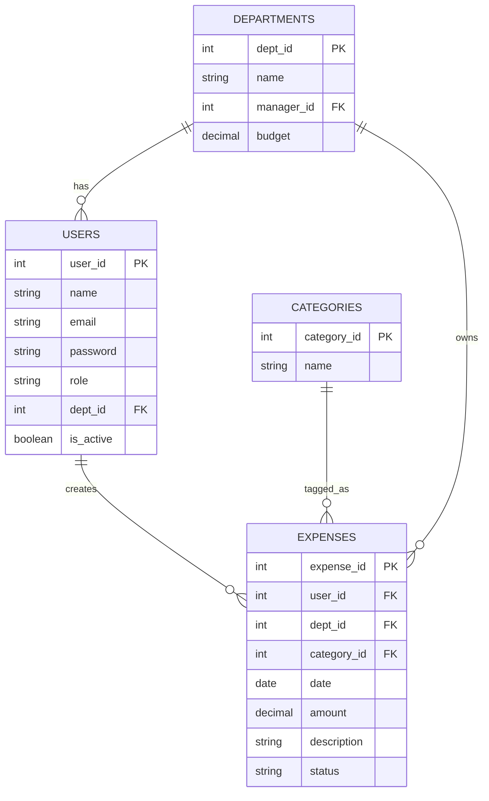

# expense-tracker-saas
Assignment – Expense Management SaaS Application

# Expense Management Database Schema

This document describes the **database design** for the Expense Management SaaS Application.

---

## Overview

This system helps a company manage employees’ expenses.  
It keeps track of:

- Departments (like HR, Engineering, Finance)
- Users (employees, approvers, admins)
- Categories (types of expenses like Travel, Food, etc.)
- Expenses (actual spending entries submitted by users)

---

## Tables and Relationships

### **Departments**
| Column | Type | Description |
|---------|------|-------------|
| `dept_id` | INT (PK) | Unique ID for each department |
| `name` | VARCHAR | Department name |
| `manager_id` | INT (FK to users.user_id) | Who manages this department |
| `budget` | DECIMAL | Optional budget amount for the department |

Each department can have one or more users.

---

### **Users**
| Column | Type | Description |
|---------|------|-------------|
| `user_id` | INT (PK) | Unique ID for the user |
| `name` | VARCHAR | Full name of the user |
| `email` | VARCHAR | Login email |
| `password` | VARCHAR | Encrypted password |
| `role` | ENUM | Role type: EMPLOYEE / APPROVER / ADMIN |
| `dept_id` | INT (FK to departments.dept_id) | Department the user belongs to |
| `is_active` | BOOLEAN | Whether the user account is active |

Each user belongs to a department and can create multiple expenses.

---

### **Categories**
| Column | Type | Description |
|---------|------|-------------|
| `category_id` | INT (PK) | Unique ID for each category |
| `name` | VARCHAR | Expense category name (e.g., Travel, Food, Office Supplies) |

---

### **Expenses**
| Column | Type | Description |
|---------|------|-------------|
| `expense_id` | INT (PK) | Unique ID for each expense |
| `user_id` | INT (FK to users.user_id) | Who created the expense |
| `dept_id` | INT (FK to departments.dept_id) | Which department this expense belongs to |
| `category_id` | INT (FK to categories.category_id) | Expense category |
| `date` | DATE | Expense date |
| `amount` | DECIMAL | Amount spent |
| `description` | VARCHAR | Short description of the expense |
| `status` | ENUM | Status: SUBMITTED / APPROVED / REJECTED / PAID |

---

## DB Schema



# Other one
```mermaid
erDiagram
    TENANTS ||--o{ DEPARTMENTS : owns
    TENANTS ||--o{ USERS : owns
    TENANTS ||--o{ CATEGORIES : owns
    TENANTS ||--o{ EXPENSES : owns

    DEPARTMENTS ||--o{ USERS : has
    USERS ||--o{ EXPENSES : creates
    CATEGORIES ||--o{ EXPENSES : tagged_as
    DEPARTMENTS ||--o{ EXPENSES : owns

    TENANTS {
        int tenant_id PK
        string tenant_name
        string domain
        datetime created_at
        boolean is_active
    }

    DEPARTMENTS {
        int dept_id PK
        int tenant_id FK
        string name
        int manager_id FK
        decimal budget
    }

    USERS {
        int user_id PK
        int tenant_id FK
        string name
        string email
        string password
        string role
        int dept_id FK
        boolean is_active
    }

    CATEGORIES {
        int category_id PK
        int tenant_id FK
        string name
    }

    EXPENSES {
        int expense_id PK
        int tenant_id FK
        int user_id FK
        int dept_id FK
        int category_id FK
        date date
        decimal amount
        string description
        string status
    }
